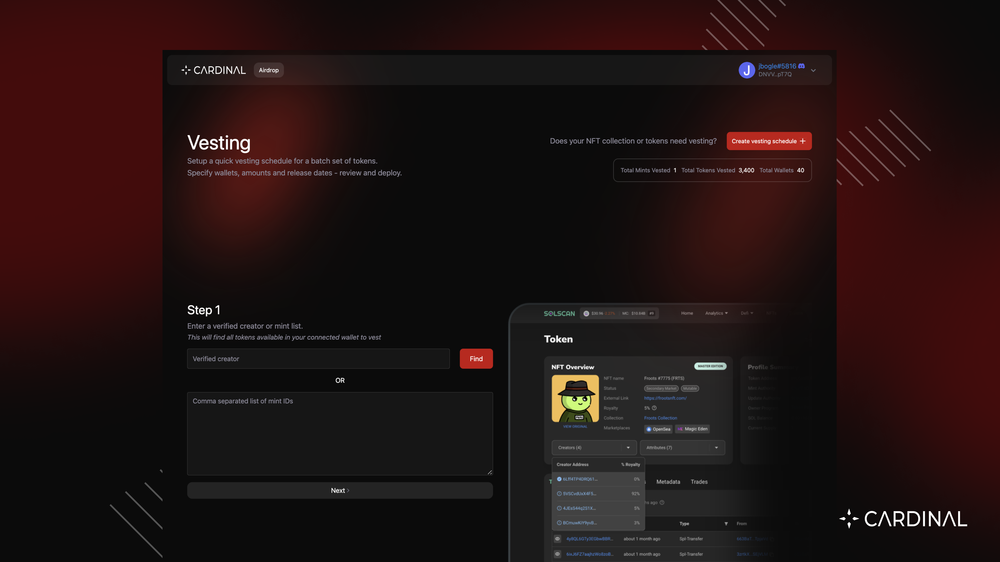

# Cardinal Vesting UI

<div style="text-align: center; width: 100%;">
  
</div>

This repository hosts the UI inteface that powers **https://vesting.cardinal.so** for vesting NFTs on Solana.

Cardinal vesting UI is a simple interface for generating a vesting schedule and or issuing large quantities of vesting NFTs. All vesting tokens are stored on-chain and vested using the underlying token-manager Solana programs.

For questions or technical help, join our **[Discord](https://discord.gg/cardinallabs)**.

---

<div style="text-align: center; width: 100%;">
  
</div>

# Getting started

To get started, visit https://vesting.cardinal.so and follow the steps

At a high level you need to create a vesting schedule that includes a csv (comma-separated values) of all the tokens that will be issued for vesting and their corresponding target address and release time.

```
[wallet, mint, release_time_unix_seconds]
```

See example vesting schedule here <a href="https://docs.google.com/spreadsheets/d/1hHqostD9kFh5lr9-xMt1BkgMscWR-dYg6IaaxGpBJXI/edit?usp=sharing" target="_blank">Example</a>

The <b>Vesting Schedule</b> can be generated in an excel file for example, and used in step 3, but steps 1 and 2 in the UI provide a way to generate a common linear vesting schedule from a list of tokens and wallet allocations

<b>If you already have a vesting schedule you can skip to step 3</b>

# Setup your vesting schedule

## Step 1

<i>Collect tokens</i>

Collect the token ids you are trying to issue for vesting. This can be achieved by pasting the verified creator into step 1

> Note: The connected wallet must hold the tokens in order to issue them for vesting

## Step 2

<i>Vesting allocations</i>

Provide the wallet addresses and their respective token allocations (share) and desired duration of vest. This step will generate a vesting schedule of linear vesting for all wallets specified.

> Note: Total shares must sum to total number of unique mints specified in step 2

## Step 3

<i>Vesting schedule</i>

Once you have completed steps 1 and 2 you can generate a vesting schedule which will be shown in the UI. You can copy and re-use this same vesting schedule for later. If a vesting schedule was generated separately it can be pasted directly in. If it looks good, you can generate and submit the transactions to issue vesting tokens.

> Note: If you already have a vesting schedule, you can skip steps 1 & 2 and paste the schedule in the correct format directly into step 3

# Claiming tokens

Once you have isssued your tokens for vesting, users must can claim their tokens to hold them locked in their wallet.

If they do not claim their tokens, they will simply get automatically transferred (airdropped) on the specified release date.

If they do claim their tokens, they will hold them in their wallet but the tokens will be frozen and cannot be traded until the specified release date upon which they will automatically release

# Vesting status

Every vesting transaction in step 3 includes a unique claim link, this link can be sent to users to claim their tokens.

For a single claim page, users can visit https://rent.cardinal.so/{verifiedCreatorId} to view all the tokens for the given creator in the URL, claim their shares and view the vesting tokens status. When a user connects their wallet, any tokens allocated to them will be shown as claimable.

> Note: If you want to have a reognized collection and custom page with banner image and colors for claiming tokens, make a request at https://rent.cardinal.so to add your collection - this can be done prior to any vesting

> Note: All tokens issued during vesting are stored on-chain. Only the specified recipient can claim this token. If it is not yet claimed, the issuer can also un-issue the token. Release times for tokens is also stored on-chain and one release time passes, the tokens will be automatically released to the target receipient (including transfer if they have not been claimed).

# Have questions?

Join our **[Discord](https://discord.gg/cardinallabs)** to get technical support as you build on Cardinal.

---
